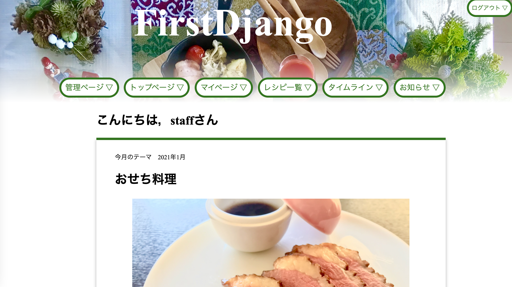
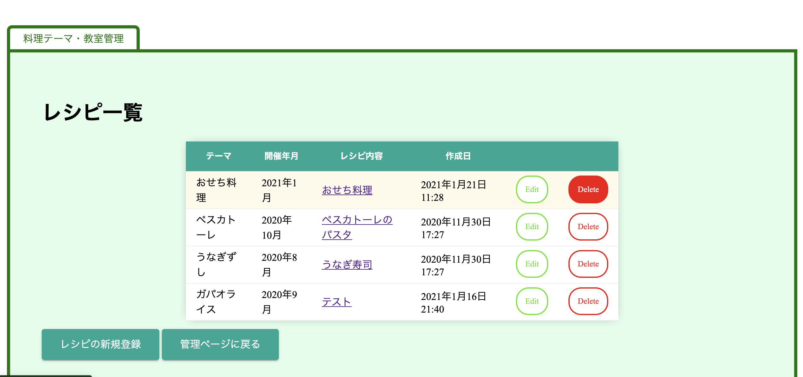
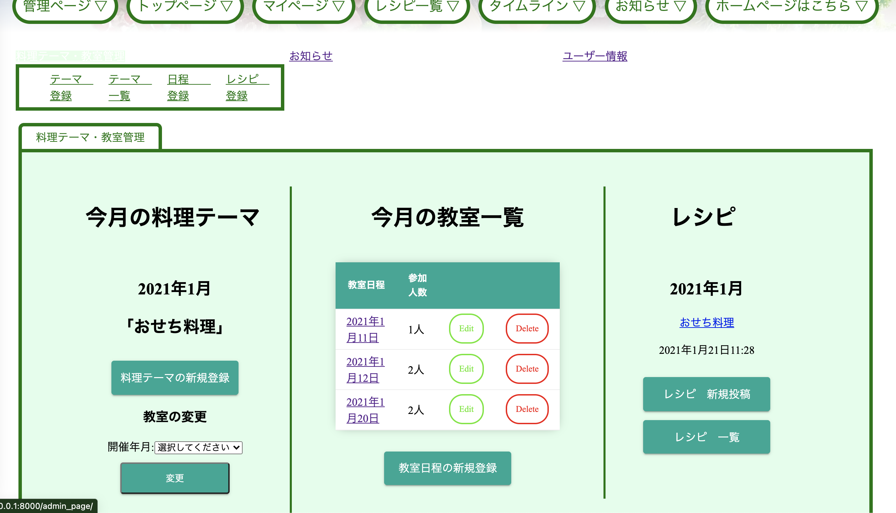
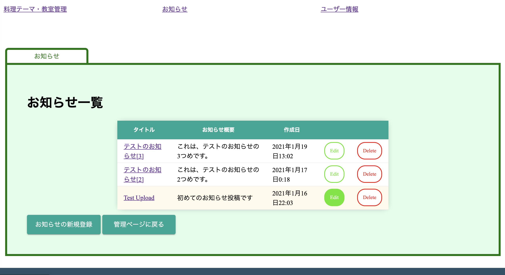
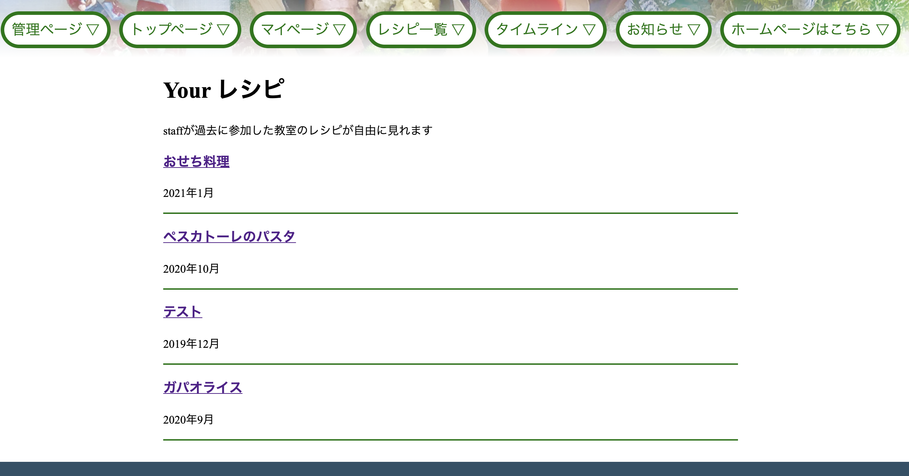
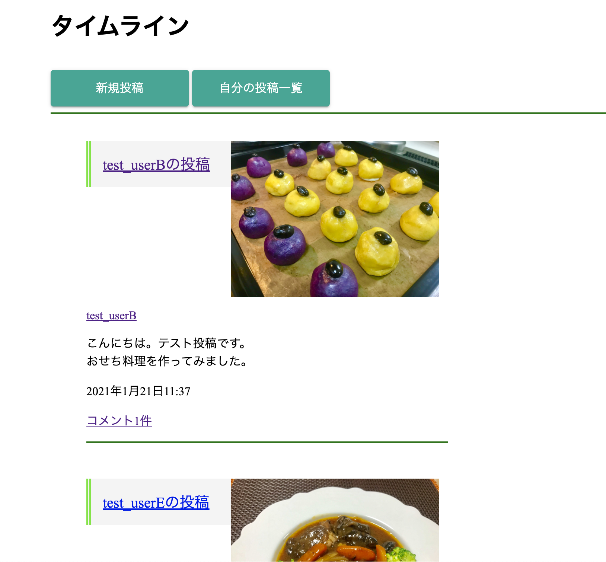

# プロジェクト名：FirstDjango
料理教室の管理効率向上のwebアプリケーション

## プロジェクト作成背景
個人で経営する料理教室において、スケジュールの管理やレシピの共有が非効率的であったという問題点に着目し、管理効率向上を目的としたWebアプリケーションを作成しました。実際に料理教室を運営する母から、現状の運営方法や問題点などのヒアリングを行い、その課題解決を目指しています。

# プロジェクト概要
料理教室のスケジュール管理・レシピの共有・教室内の小規模なSNSを可能とするwebアプリケーションです。
"管理者"と"一般ユーザー"に分けた仕様になっており、それぞれに実装した機能を以下に示します。
なお、本プロジェクトでは、月毎に料理テーマがあり、月内に数回同じテーマで教室が開催されることを想定しています。

## 機能一覧
（管理者）
- 料理テーマの作成・編集・削除
- 教室日程及び参加ユーザーの登録・編集・削除
- レシピの投稿・編集・削除
- お知らせの投稿・編集・削除
- ユーザーの管理
- タイムラインの投稿・コメント

（一般ユーザー）
- 料理テーマ・教室日程の確認
- 参加した教室のレシピダウンロード
- お知らせの閲覧
- タイムラインの投稿・コメント

# 開発環境
## 使用言語・フレームワーク
- python 3.8.2
- Django 3.1.5

## OS
MacOS BigSur 11.1

## 環境構築の手順
1. venvを用いた仮想環境に入る
2. 仮想環境内でDjangoをインストール
  - $ pip3 install django
3. データベース関連の設定
  - $ python3 manage.py makemigrations
  - $ python3 manage.py migrate
  - $ python3 manage.py createsuperuser
4. サーバーの立ち上げ
  - $ python3 manage.py runserver

# デモ画像
本Webアプリケーションのデモ画像として、主要ページを以下に示します。なお、（管理者）と表記があるものは管理者用のページです。
- トップページ

- （管理者）管理用ページ

- （管理者）レシピ一覧ページ

- （管理者）お知らせ一覧ページ

- （一般ユーザー）レシピ一覧ページ

- タイムライン

# 未実装タスク
- [ ] DB検索機能
- [ ] 予約申請・承認機能
- [ ] タイムラインいいね機能
- [ ] レスポンシブ化
- [ ] フロントエンドの高度化
- [ ] デプロイ
